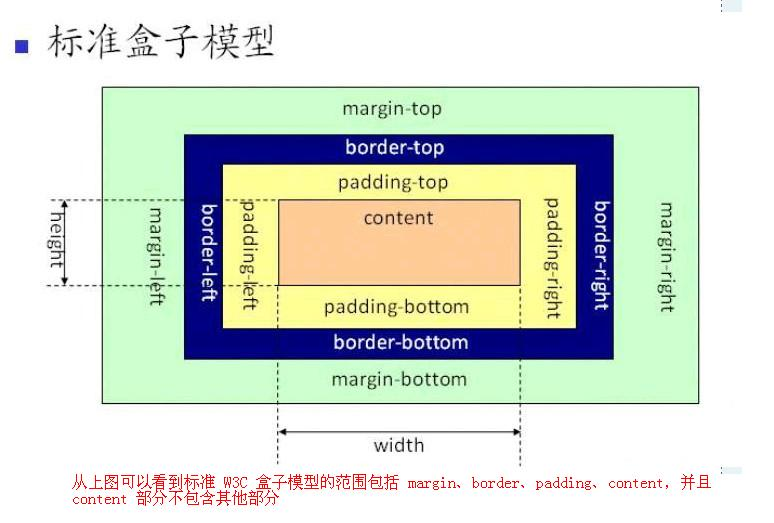

# CSS 中的盒模型

## 什么是盒模型（Box Model）？

	可以把所有的HTML元素都看作是一个盒子，它包括：边距、边框、填充以及实际内容
		Margin(外边距) - 清除边框外的区域，外边距是透明的。
		Border(边框) - 围绕在内边距和内容外的边框。
		Padding(内边距) - 清除内容周围的区域，内边距是透明的。
		Content(内容) - 盒子的内容，显示文本和图像

	最终元素的总宽度计算公式是这样的：
	总元素的宽度=宽度+左填充+右填充+左边框+右边框+左边距+右边距
	元素的总高度最终计算公式是这样的：
	总元素的高度=高度+顶部填充+底部填充+上边框+下边框+上边距+下边距

### 外边距（Margin）

	margin：100px 四边相同
	margin：100px  200px 上下  左右
	margin：100px  200px  300px  上  左右  下
	margin：100px  200px  300px  400px 上 右 下 左
	
	单边设置：
	margin-left:100px
	margin-top:100px 
	当前元素向右移动,当前元素向下移动（自己动）
	
	margin-right:100px
	margin-bottom:100px
	别的元素向右移动,别的元素向下移动（别人动）

​	
### 内边距（Padding）

	padding：100px 四边相同
	padding：100px  200px 上下  左右
	padding：100px  200px  300px  上  左右  下
	padding：100px  200px  300px  400px 上 右 下 左
	
	单边设置：
	padding-left:100px

### 边框 (Border)

	1、边框的样式：  border-style:
		none 			默认无边框
		dotted			定义一个点线边框
		dashed			定义一个虚线边框
		solid			定义实线边框
		double			定义两个边框,两个边框的宽度和 border-width 的值相同
		
		单边框设置：
				上边框 border-top:
				下边框 border-bottom:
				左边框 border-left:
				右边框 border-right:
				
	2、边框的宽度：  border-width:
	
	3、边框的颜色：  border-color:
		name			指定 颜色名称
		RGB				指定 RGB 值
		Hex 			指定 十六进制值
		
		需要注意的是：border-color单独使用是不起作用的，必须得先使用border-style来设置边框样式。
		
		可简写属性： border: 宽度，样式，颜色

### 外边距的负值问题

	margin-top为负值像素，偏移值相对于自身，其后元素受影响
	margin-top为负值百分数，偏移值相对于父元素，其后元素受影响
	
	margin-left为负值像素，偏移值相对于自身，其后元素不受影响
	margin-left为负值百分数，偏移值相对于父元素，其后元素不受影响
	
	margin-right为负值像素且不设置宽度，自身无偏移值，自身宽度变大，其后元素不受影响
	margin-right为负值百分数且不设置宽度，自身无偏移值,自身宽度变宽(宽度值为父元素宽度值*百分比)，其后元素不受影响
	
	margin-bottom:为负值像素，自身无偏移值,，其后元素受影响(上移了)
	margin-bottom:为负值百分数，自身无偏移值,，其后元素受影响(上移了,上移大小为父元素宽度值*__%)

### 外边距合并问题

	外边距合并问题针对于 上下外边距，左右外边距不存在问题
	原因：从上到下 加入浮动(float)以后才能从左到右（游览器只会计算上下同时解析，
	左右是不会去解析的（左右（margin）可以各算各的））
	外边距是不脱离普通文档流的，要按照普通文档流的标准解析
	
	第一种情况：
		兄弟关系的盒子
		
		上盒子的 margin-bottom: ___ 和下盒子的 margin-top: ___ 同时存在时，
		会出现外边距合并的问题
			两个相邻的外边距都是正数时，折叠结果是它们两者之间较大的值;
			两个相邻的外边距都是负数时，折叠结果是两者绝对值的较大值;
			两个相邻的外边距一正一负时，折叠结果是两者的相加的和;
		
		如何解决/避免呢？
		只给其中的一个盒子加   外边距
		加  下边距  
		
	第二种情况：
		父子关系的盒子
		
		父盒子的 margin-top: ___ 和子盒子的 margin-top: ___ 同时存在时，
		会出现外边距合并的问题，margin会取值大的作为距离父盒子上方的元素的值，
		并不会出现子盒子 想要距离父盒子 margin-top: ___ 的效果
		
		如何达到子盒子 想要距离父盒子 margin-top: ___ 的效果?
		方案一：给父盒子加边框
		方案二：子盒子的 margin-top 换成 padding-top ，写在父盒子上

### 外边距的特殊用法

	设置 margin：auto;能够实现元素水平方向上的居中
	
	为什么设置 auto 能够实现居中？
		一般子是否在父元素里面居中都是需要计算的，
		如果父元素的宽度是200px,子元素的宽度是100px,
		公式：父元素的宽度 = 子元素的宽度 + padding + margin + border (w3c标准盒子模型) ,
		这里子元素没有padding,border,那么子的外边距 margin 应该是（200-100）/2 = 50px ，
		如果子元素直接设置margin:auto,那么这个auto就是50px,
		所以这种居中是靠外边距margin-left 和margin-right来实现居中的,
		
	为什么左右生效，上下不生效呢？
		我们在设置 margin: auto; 去审查元素时发现，
		上下的 margin 并没有生效，
		w3c默认规定 margin-top 和 margin-right 为0，所以实现不了垂直居中
		
	也就是说 设置 margin: auto  <===> margin: 0 auto

### 内边距不能设置负值

### 内边距的使用问题

	当时盒子设置了 padding 时，盒子的整体尺寸会变大，
	
	如何解决/避免？
	方案一：在当前盒子对应的减去增加的尺寸
	方案二：box-sizing: border-box;

### 盒模型的种类

1、标准盒模型（W3C）

	盒子设置宽高后，再去设置padding, border时，此时盒子的实际大小会变大
2、怪异盒模型（IE）

	盒子设置宽高后，再去设置padding, border时，此时盒子不会被撑开，它会挤压内容区

	盒模型之间的切换
		box-sizing:
			border-box	怪异盒模型（IE）
			content-box 标准盒模型（W3C）

## CSS 的元素显示模式

### 什么是元素显示模式

	元素显示模式就是元素以什么方式进行显示，比如：
独占一行，一行可以放多个
	作用：网页标签非常多，在不同的地方使用不同的标签，了解它们的特点可以更好的布局网页

### 元素显示模式的分类

	HTML元素一般分为块级元素和行内元素两种类型
	1、块级元素：
、<h1> ~ <h6>、
、 <ol>、<ul>、<li>等
		特点： 1：独占一行
			  2：高度、行高、外边距以及内边距都可以控制
			  3：宽度默认是父级容器宽度的100%
			  4：内部可以放块级或行内元素
			  
		注意：文字类的元素内不能存放块级元素
		
标签主要存放文字，因此
标签不能放块级，如：div
		
	2、行内元素（内联元素）：、 <b>、 <i>、 <a> 等
		特点： 1：相邻行内元素在一行上，一行可以显示多个
			  2：高度、行高直接设置是无效的，
			  3：水平方向的padding和margin可以设置，垂直方向的无效
			  4：宽度默认是它本身内容的宽度
			  5：行内元素只能容纳文本或则其他行内元素
			  
		注意：链接内不能放链接
		<a>可以放块级元素，但是给<a>转换一下块级模式最安全
		
	3、特殊元素（行内块元素）：、 <input>、 <td>
		特点： 1：一行内可以放多个行内块元素，元素之间有空格
			  2：可以设置宽度和高度
			  3：默认的宽度就是它本身内容的宽度
			  
	4、置换元素和非置换元素
		浏览器根据元素的标签和属性，来决定元素的具体显示内容

### 元素显示模式的转换

	特殊情况下，我们需要元素模式的转换，
	简单来说：一种模式的元素需要另一种模式元素的特性，这个时候就需要进行模式的转换
	
	display 属性: 属性值
	 
	转换成块级元素：display: block
	转换成行内元素：display: inline
	转换成行内块元素：display: inline-block
	
	display: none 元素不显示

### 透明属性

	1.background:rgba(255,0,0,0-1);
		0-1数值越小越透明
		没有继承性
	2.opacity:0-1;
		有继承性
		background: rgb(255,255,255);
		opacity: 0.6;
	3.IE6-8
		filter:alpha(opacity=60)
			数值是0-100

### 垂直对齐属性

	只有元素类型是行内块或者设置了display：inline-block的时候才支持vertical-align属性
	
	vertical-align