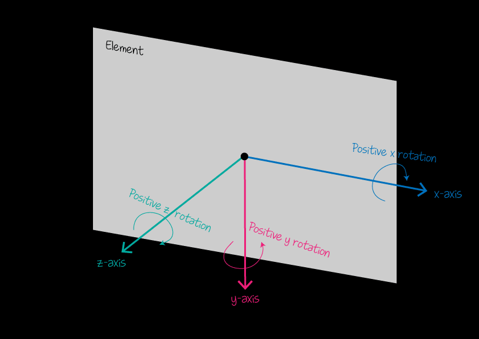

# CSS3中的特殊样式

## CSS3中的转换

	CSS3 转换可以对元素进行移动、缩放、转动、拉长或拉伸
	transform			适用于2D或3D转换的元素
	deg 				角度
	
### 2D转换
	
	translate(x,y)			定义 2D 移动，沿着 X 和 Y 轴移动元素
	translateX(n)			定义 2D 移动，沿着 X 轴移动元素
	translateY(n)			定义 2D 移动，沿着 Y 轴移动元素
	
	scale(x,y)				定义 2D 缩放，改变元素的宽度和高度
	scaleX(n)				定义 2D 缩放，改变元素的宽度
	scaleY(n)				定义 2D 缩放，改变元素的高度
	
	rotate(angle)			定义 2D 旋转，在参数中规定角度
	
	skew(x-angle,y-angle)	定义 2D 倾斜，沿着 X 和 Y 轴
	skewX(angle)			定义 2D 倾斜，沿着 X 轴
	skewY(angle)			定义 2D 倾斜，沿着 Y 轴

	
### 3D转换
	
	translate3d(x,y,z)		定义 3D 移动
	translateX(x)			定义 3D 移动，仅使用用于 X 轴的值
	translateY(y)			定义 3D 移动，仅使用用于 Y 轴的值
	translateZ(z)			定义 3D 移动，仅使用用于 Z 轴的值
	
	rotateX(par)函数功能等同于rotate3d(1,0,0,par)
	rotateY(par)函数功能等同于rotate3d(0,1,0,par)
	rotateZ(par)函数功能等同于rotate3d(0,0,1,par)

	
	scale3d(x,y,z)			定义 3D 缩放
	scaleX(x)				定义 3D 缩放，通过给定一个 X 轴的值
	scaleY(y)				定义 3D 缩放，通过给定一个 Y 轴的值
	scaleZ(z)				定义 3D 缩放，通过给定一个 Z 轴的值
	
	skew(x-angle,y-angle)	定义 3D 倾斜，沿着 X 和 Y 轴
	skewX(angle)			定义 3D 倾斜，沿着 X 轴
	skewY(angle)			定义 3D 倾斜，沿着 Y 轴
	
	rotate3d(x,y,z,angle)	定义 3D 旋转
	rotateX(angle)			定义沿 X 轴的 3D 旋转
	rotateY(angle)			定义沿 Y 轴的 3D 旋转
	rotateZ(angle)			定义沿 Z 轴的 3D 旋转
	
	
	3D效果需要设置的属性
	transform--style		属性指定嵌套元素是怎样在三维空间中呈现
		flat		表示所有子元素在2D平面呈现
		preserve-3d	表示所有子元素在3D空间中呈现
		注意：transform-style属性需要设置在父元素中，并且高于任何嵌套的变形元素
	perspective(n)			定义 3D 转换元素的透视视图
	perspective-origin		定义 3D 元素所基于的 X 轴和 Y 轴
		x-axis		定义该视图在 x 轴上的位置。默认值：50%
		y-axis		定义该视图在 y 轴上的位置。默认值：50%
	backface-visibility		定义当元素背面向屏幕时是否可见
		visible		背面是可见的
		hidden		背面是不可见的
	
## CSS3中的过渡

	CSS3 过渡是元素从一种样式逐渐改变为另一种的效果
	要实现这一点，必须规定两项内容
		指定 要添加效果的CSS属性
		指定 效果的持续时间
		
	transition-property			过渡的 CSS 属性的名称
		none		没有属性会获得过渡效果。
		all			所有属性都将获得过渡效果。
		property	应用过渡效果的 CSS 属性名称列表，列表以逗号分隔
		
	transition-duration			过渡效果花费的时间，默认是 0
		time		过渡效果需要花费的时间（以秒或毫秒计），默认值是 0，意味着不会有效果
		
	transition-timing-function	过渡效果的时间曲线，默认是 "ease"
		linear		规定以相同速度开始至结束的过渡效果（等于 cubic-bezier(0,0,1,1)）
		ease		规定以慢速开始，然后变快，然后慢速结束的过渡效果（cubic-bezier(0.25,0.1,0.25,1)）
		ease-in		规定以慢速开始的过渡效果（等于 cubic-bezier(0.42,0,1,1)）
		ease-out	规定以慢速结束的过渡效果（等于 cubic-bezier(0,0,0.58,1)）
		ease-in-out	规定以慢速开始和结束的过渡效果（等于 cubic-bezier(0.42,0,0.58,1)）
		cubic-bezier(n,n,n,n)	在 cubic-bezier 函数中定义自己的值。可能的值是 0 至 1 之间的数值
		
	transition-delay			过渡效果何时开始，默认是 0
		time		指定秒或毫秒数之前要等待切换效果开始
		
	transition	简写属性，用于在一个属性中设置四个过渡属性
	
## CSS3中的动画
	
	CSS3 动画是使元素从一种样式逐渐变化为另一种样式的效果
	要创建 CSS3 动画，需要了解 @keyframes 规则
		@keyframes 规则是创建动画
		@keyframes 规则内指定一个 CSS 样式和动画将逐步从目前的样式更改为新的样式
		
	当在 @keyframes 创建动画，把它绑定到一个选择器，否则动画不会有任何效果
	指定至少这两个CSS3的动画属性绑定向一个选择器
			规定动画的名称
			规定动画的时长
	
	第一步：定义一个动画
	@keyframes 动画名称 {
		
				/*定义关键帧*/
				from 或者 0%{
					css-styles:
				}
				
				50%{
					css-styles:
				}
				
				to 或者 100%{
					css-styles:
				}
			}
	第二步：执行这个动画
		animation: 动画名称  执行时间  速度效果  延迟时间  执行次数  往复执行;
			animation-name				动画名称
			animation-duration			执行时间
			animation-timing-function	速度效果
			animation-delay				延迟时间
			animation-iteration-count	执行次数
			animation-direction			往复执行
	第三步：暂停这个动画
		animation-play-state:paused;